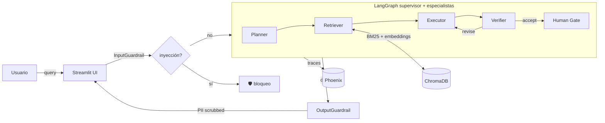

# DocOps Agent

Un copiloto empresarial que procesa documentos privados y asiste en tareas operativas, construido durante el **AI Engineer Bootcamp de Código Facilito** (2026).

## Demo

> Reemplaza esta línea con tu URL pública después del deploy.
> Ej.: <https://ramsescamas-docops-agent.hf.space>


## Qué hace

Responde preguntas sobre documentos corporativos usando RAG híbrido (BM25 + embeddings + cross-encoder reranking), ejecuta tareas operativas vía tools con MCP, y mantiene memoria persistente de la conversación por thread. Expone una UI de Streamlit con métricas de latencia, tokens y quality score en vivo.

## Arquitectura



- **RAG**: ChromaDB embebido + retrieval híbrido (BM25 + embeddings) + rerank con cross-encoder.
- **Agente**: LangGraph multiagente (Planner → Retriever → Executor → Verifier) con bucle de calidad y Human-in-the-Loop.
- **Tools**: MCP server para integraciones estándar (clase 13).
- **Observabilidad**: Arize Phoenix con OpenTelemetry autoinstrumentando LangChain/LangGraph.
- **Seguridad**: tres capas de guardrails — input (prompt injection), output (PII scrubbing), tool (HITL para destructivas).

## Stack

LangGraph · ChromaDB · Groq (`openai/gpt-oss-120b` / `llama-3.3-70b-versatile`) · Streamlit · Arize Phoenix · Docker.

Todo en **free tier** — sin OpenAI, Anthropic ni servicios de nube pagados.

## Cómo se evalúa

Evaluación continua en CI local con dataset curado (clase 14) + métricas tipo-RAGAS implementadas desde cero (clase 15):

| Métrica | Valor |
|---|---|
| Faithfulness | _completa con tu número_ |
| Context precision | _completa con tu número_ |
| Answer relevancy | _completa con tu número_ |
| Golden tests | _N/N passing_ |
| Latencia p95 | _X.X s_ |

Reproduce con:
```bash
make eval
make test
```

## Limitaciones conocidas

- **Free tier de HF Spaces**: 16 GB RAM pero cold start de ~30 s tras 48 h de inactividad.
- **ChromaDB embebido**: escala razonablemente hasta ~100k chunks; más allá conviene un vector store dedicado.
- **Solo documentos en español**: el prompt del Planner y los ejemplos están en español.
- **Groq TPD**: el plan free tiene 100k tokens/día; queries complejas con revisión iterativa pueden agotarlo.
- **Sin persistencia en Streamlit Cloud / Render free**: la colección se reindexa en cada cold start.

## Correr localmente

```bash
cp .env.example .env          # completa GROQ_API_KEY
pip install -r requirements.txt
make phoenix-up               # opcional, para ver traces en localhost:6006
streamlit run streamlit_app.py
```

Verifica el stack antes de deployar:
```bash
python scripts/demo_class_16.py
make release-check
```

## Deploy

Tres destinos probados, todos free tier. Escoge según tus necesidades:

| Destino | RAM | Persistencia | Cold start | Guía |
|---|---|---|---|---|
| **Hugging Face Spaces** | 16 GB | No (free) | ~30 s | [README_HF.md](./README_HF.md) |
| **Streamlit Community Cloud** | 1 GB | No | ~15 s | [README_STREAMLIT.md](./README_STREAMLIT.md) |
| **Render (web service)** | 512 MB | No (free) | ~45 s | [README_RENDER.md](./README_RENDER.md) |

## Estructura del repo

```
agents/           · LangGraph multiagente (clases 10-12)
contracts/        · Pydantic + tool schemas (clase 4)
core/             · llm_client, tokenlab, config, logger (clases 1-2)
dspy_lab/         · compile/optimize (clase 15)
evals/            · datasets, runner, métricas RAGAS-like (clases 14-15)
mcp-clase13/      · MCP server + cliente (clase 13)
memory/           · store persistente (clase 12)
ops/              · observability + guardrails (clase 16, NUEVO)
orchestration/    · pipelines (clase 9)
prompting/        · templates + few-shot (clase 3)
rag/              · embeddings, ingestion, retrieval híbrido (clases 5-8)
scripts/          · demos y release_check
streamlit_app.py  · UI de producción (clase 16)
Dockerfile        · build para HF Spaces (clase 16)
render.yaml       · blueprint para Render (clase 16)
.streamlit/       · config para Streamlit Cloud (clase 16)
```

## Autor

**Ramsés Camas** — AI Engineer Bootcamp Código Facilito (2026).
Hecho con ❤️ en vivo frente a ~40 estudiantes.
